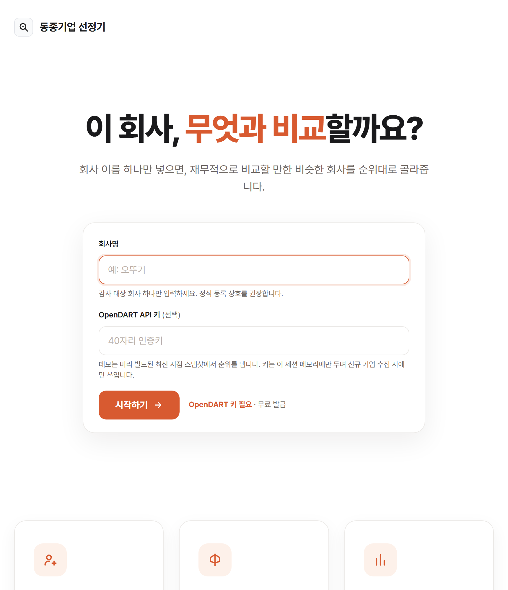
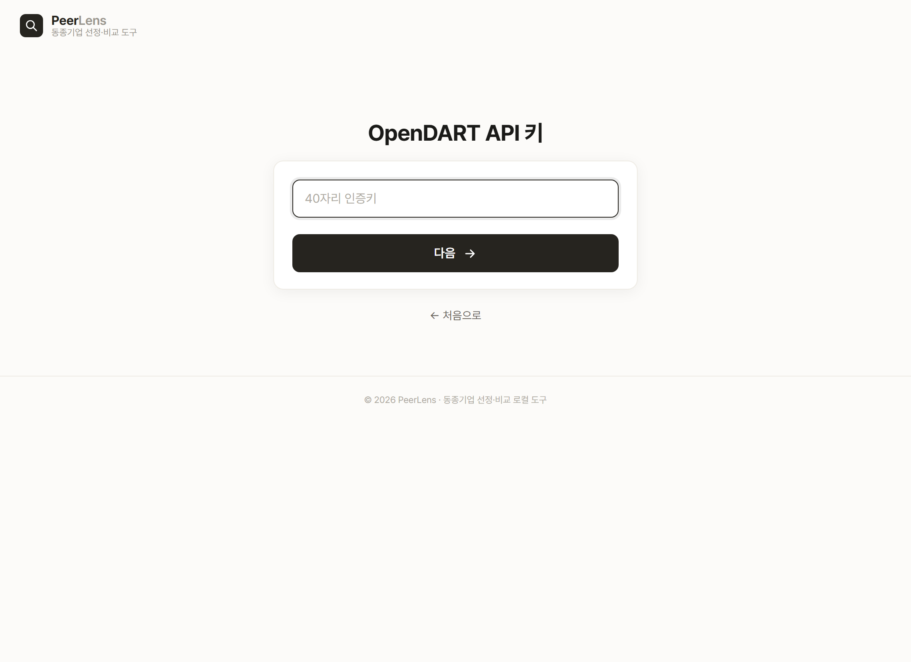

# 동종기업 선정기 (PeerLens)

🇰🇷 한국어 | [🇺🇸 English](README.en.md)

**회사 이름 하나만 넣으면, 그 회사와 재무적으로 비교할 만한 동종기업을 찾아 순위로 보여주는 도구입니다.**

## ▶️ 데모 영상


▶️ https://youtu.be/JROeAkh1-N8

## 이런 도구입니다

감사인은 한 회사를 분석할 때 늘 같은 질문에 부딪힙니다 — **"이 회사를 무엇과 비교할 것인가?"**

재무비율이 높은지 낮은지, 정상인지 이상한지는 **비슷한 회사와 견줘봐야** 알 수 있습니다. 그런데 "비슷한 회사"를 고르는 일은 대개 사람의 감에 의존합니다. 같은 업종이라고 다 비교 대상이 되는 것도 아니고, 규모가 비슷하다고 사업이 비슷한 것도 아닙니다. 이 선택이 흔들리면 그 뒤의 분석 전체가 흔들립니다.

이 도구는 그 선택을 **데이터로** 대신합니다.

1. 회사 이름으로 **재무·사업 정보를 자동으로 가져오고**
2. 업종·규모·시가총액·사업내용을 **종합해 비슷한 정도를 계산하고**
3. **비슷한 순서대로 동종기업을 정리**하고
4. 각 회사가 **왜 뽑혔는지, 얼마나 믿을 만한지** 함께 보여 줍니다.

회사명 하나 넣고 기다리면, 비교 대상 선정을 한자리에서 끝냅니다.

## 누구에게·왜 필요한가

**이런 분들을 위해 만들었습니다 — 회계법인 감사팀.**
분석적 절차를 준비할 때, 새 고객의 재무를 검토할 때, 비교 대상을 정해야 할 때 쓰는 도구입니다.

**감사인이 실제로 겪는 어려움**

- 비교할 동종기업을 **사람의 판단으로 고르다 보니**, 근거가 흔들리고 사람마다 달라집니다.
- 같은 업종 코드라도 **규모가 극단적으로 다르거나** 사업이 딴판인 회사가 섞여, 비교가 무의미해질 때가 있습니다.

**이 도구가 해결하는 방식**
업종·규모·시가총액·사업내용을 데이터로 종합해, **비슷한 순서대로** 동종기업을 제시합니다. 그리고 각 회사가 어느 면에서 비슷한지(업종·규모·사업내용)를 태그로 밝히고, 비교가 확실한지 아닌지를 신뢰도로 알려 줍니다. 고르는 사람의 감을 데이터가 대신합니다.

**이렇게 활용합니다**

- **분석적 절차 준비** — 재무비율을 견줄 비교군을 데이터로 선정
- **신규 수임 검토** — 새로 맡을 회사의 동종기업을 빠르게 파악
- **비교 대상 근거 확보** — 왜 이 회사들과 비교했는지 근거를 남김

## 이렇게 나옵니다

회사명 하나를 넣으면 아래처럼 나옵니다.



*랜딩 화면 — 제품 소개와 시작 버튼.*



*API 키 입력 — OpenDART 인증키를 넣습니다.*


*결과 화면 — 비슷한 순서로 정리된 동종기업, 각 회사의 유사 근거 태그와 신뢰도.*

## 실행 방법

필요한 것: **Python 3**, 그리고 **OpenDART API 키**(무료).

```
1) (최초 1회) pip install -r requirements.txt
2) start.bat  더블클릭             ← Windows
   ./start.sh                      ← macOS / Linux
3) 브라우저가 http://127.0.0.1:5000 을 자동으로 엽니다
4) 화면에서 API 키 입력 → 회사명 입력 → 결과 확인
```

> **이 도구는 내 PC에서 돌아갑니다.** `start.bat`을 더블클릭하면 실행 창이 하나 열리고, 잠시 뒤 브라우저가 자동으로 열립니다. **쓰는 동안 이 실행 창을 닫지 마세요 — 이 창이 서버를 유지합니다.** 다 쓴 뒤 창을 닫으면 서버가 꺼집니다.

**API 키가 필요합니다.** OpenDART 인증키는 **무료**로 발급받습니다.

| 키 | 발급처 |
|---|---|
| `OPENDART_API_KEY` | https://opendart.fss.or.kr (오픈다트 인증키) |

> 키는 **화면에서 입력**하며, 이 PC의 메모리에만 잠깐 머물다 서버를 끄면 사라집니다. 파일이나 기록에 저장하지 않고, 내 PC 안에서만 돌아 밖으로 나가지 않습니다. (키 이름만 담긴 `.env.example`을 참고하세요.)

## 이 도구가 신경 쓴 것

만들면서 특히 공들인 네 가지입니다.

**1. 사람의 감이 아니라 데이터로 고릅니다.**
"비슷한 회사"를 사람이 손으로 고르면 근거가 흔들리고 사람마다 달라집니다. 이 도구는 업종·규모·시가총액·사업내용을 데이터로 종합해, 같은 방식으로 일관되게 동종기업을 고릅니다.

**2. 한 가지가 아니라 네 가지를 함께 봅니다.**
업종이 같다고 다 비슷한 회사는 아닙니다. 그래서 업종만이 아니라 규모·시가총액·사업내용까지 네 가지를 함께 따져, 여러 면에서 고르게 닮은 회사를 위로 올립니다. 한쪽만 같고 나머지가 딴판인 회사에 속지 않습니다.

**3. 억지로 채우지 않고, 없으면 없다고 합니다.**
업종이 비슷한 회사가 없으면 규모만 비슷한 회사로 빈자리를 메우지 않습니다. **"업종이 비슷한 동종기업을 찾지 못했습니다"**라고 정직하게 표시합니다. 그리고 비교가 어려운 회사는 **신뢰도 낮음**으로 솔직하게 알립니다.

**4. 특정 회사가 아니라 어느 상장사든 동작합니다.**
특정 회사에 맞춘 값을 미리 넣어두지 않았습니다. 회사 이름만 넣으면 어느 상장사든 같은 방식으로 처리합니다. 판정 기준은 전부 데이터에서 도출했습니다.

---
_개발자용 안내는 `docs/` 폴더를 참고하세요._
